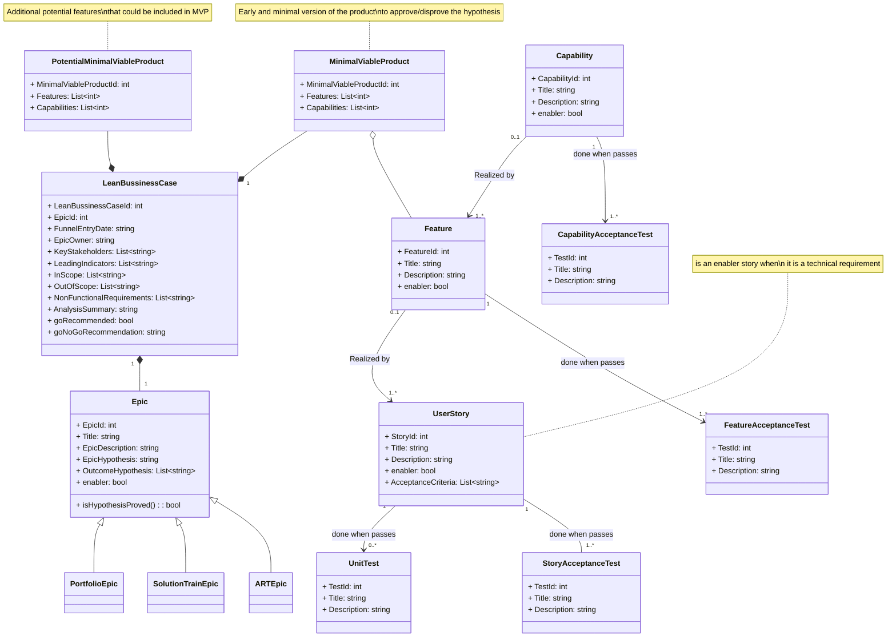

# SAFe Requirements Model

The SAFe Requirements Model is a hierarchical model that defines requirements at the Epic, Feature, and Story levels. It is based on the [INVEST](https://en.wikipedia.org/wiki/INVEST_(mnemonic)) model for writing good user stories. The SAFe Requirements Model is a living document that will be updated as the product evolves and new requirements are identified.


[SAFe Requirements Model](https://scaledagileframework.com/safe-requirements-model/)

## Our Class Diagram Implementation

Taking the SAFe Requirements Model as a reference, we have implemented the following Class Diagram, and is the one used to generate the `frontMatter.taxonomy.contentTypes` json.

Feel free to modify it to fit your needs, to suggest improvements, or sharing your ideas in the [Discussions](giscussions) section, or reporting an [Issue](issues). Togheter we can improve this project! 🚀



Generate the `frontMatter.taxonomy.contentTypes` json based on previous Class Diagram, following example below:

```json
"frontMatter.taxonomy.contentTypes": [
  {
    "name": "Epic",
    "previewPath": null,
    "pageBundle": false,
    "fields": [
      {
        "title": "Title",
        "name": "title",
        "type": "string"
      },
      {
        "title": "Description",
        "name": "description",
        "type": "string"
      },
      {
        "title": "Publishing date",
        "name": "date",
        "type": "datetime",
        "default": "{{now}}",
        "isPublishDate": true
      },
      {
        "title": "Last modified date",
        "name": "lastmod",
        "type": "datetime",
        "isModifiedDate": true
      },
    ]
  },
  {
    name: "Capability",
    previewPath: null,
    pageBundle: false,
    fields: [
      {
        title: "Title",
        name: "title",
        type: "string"
      },
      {
        title: "Description",
        name: "description",
        type: "string"
      },
      {
        title: "Publishing date",
        name: "date",
        type: "datetime",
        default: "{{now}}",
        isPublishDate: true
      },
      {
        title: "Last modified date",
        name: "lastmod",
        type: "datetime",
        isModifiedDate: true
      },
    ]
  }
]
```

Association -->  
In an association relationship, one or more objects can be associated with each other.  
Objects are linked with each other.

o--	Aggregation  
In an aggregation relationship, objects that are associated with each other can remain in the scope of a system without each other.  
Linked objects are not dependent upon the other object.

*--	Composition  
In a composition relationship, objects that are associated with each other cannot remain in the scope without each other.  
Objects are highly dependent upon each other.

## References

- [SAFe Requirements Model](https://scaledagileframework.com/safe-requirements-model/)
- [FrontMatter](https://frontmatter.codes) and [Content Types](https://frontmatter.codes/docs/content-creation/content-types)